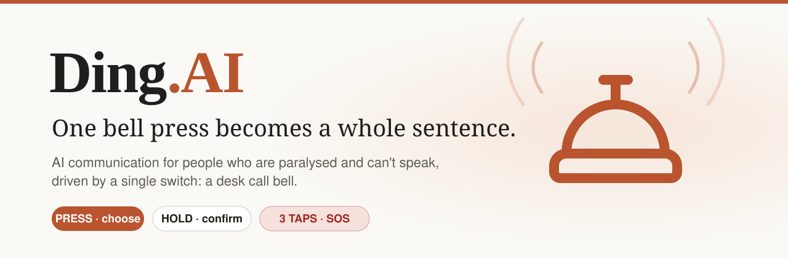
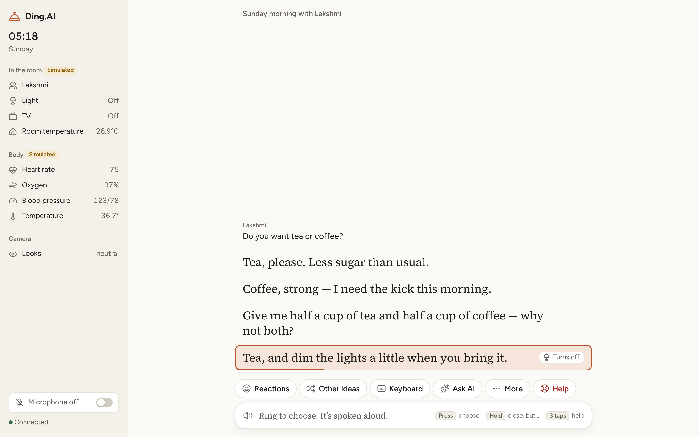
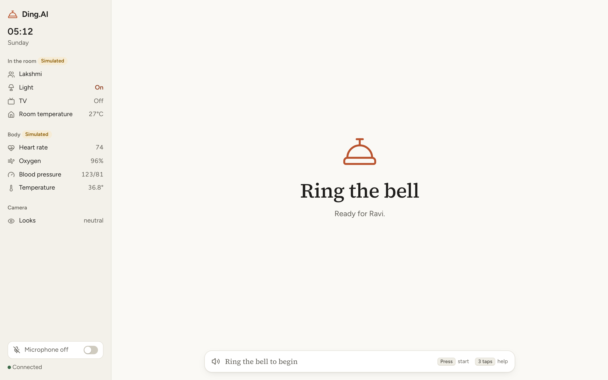
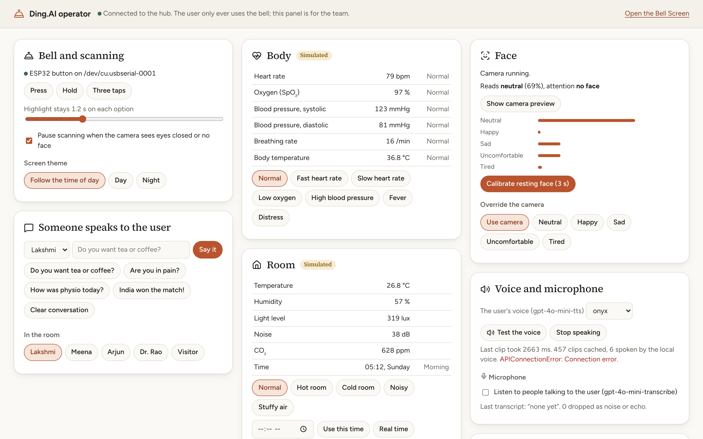
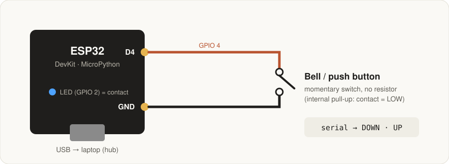
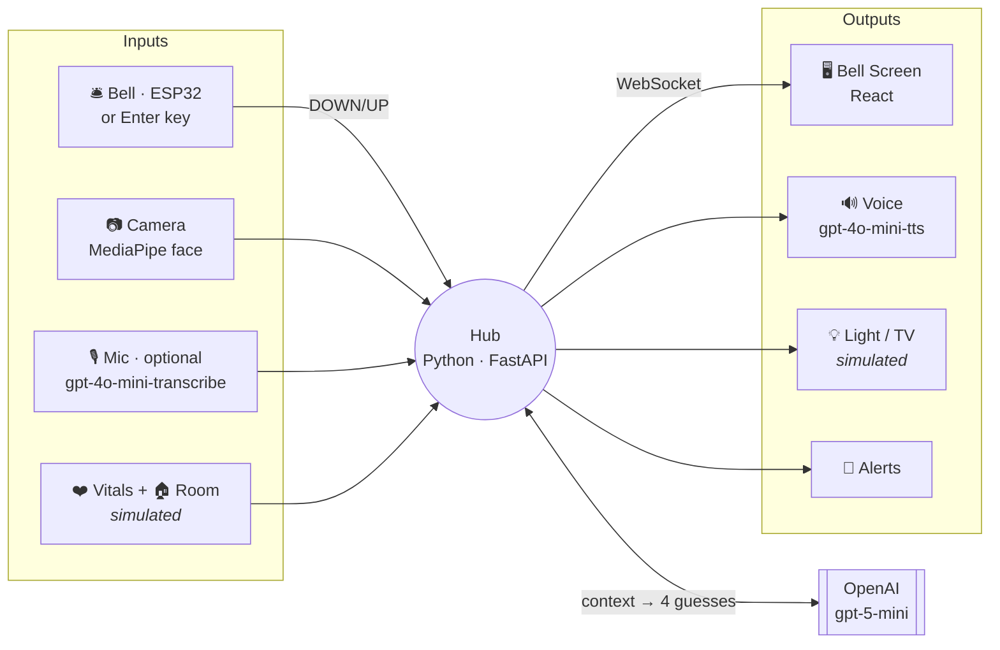

<p align="center">
  
</p>

<p align="center">
  <b>Hacking Human Ability Hackathon</b> · Claude Community × Superhuman Labs
  <br><br>
  
  
  
  
  
</p>

---

> **Hector's bell could say one thing: *come here*.
> Ding.AI's bell can say anything.**

People with **ALS** or **locked-in syndrome** often keep a sharp mind and exactly **one** reliable movement. With single-switch scanning, that means spelling letter by letter at a few words per minute. By the time the sentence is done, the conversation has moved on.

**Ding.AI doesn't make you spell.** It knows who's in the room, what was just said, the time, the room and your face. It **guesses what you want to say** and offers it one option at a time. **One ring says the whole sentence**, out loud, in your voice.

<p align="center">
  
  <br>
  <sub><i>Lakshmi asks "Do you want tea or coffee?". About 3 s later the screen offers four answers, all in the user's voice. One ring, and it's said.</i></sub>
</p>

---

## 🛎️ One bell. Three gestures. Everything.

| Gesture | Ring | What it does |
|:--|:--|:--|
| **Press** | one tap | choose the highlighted option (it's spoken aloud) |
| **Hold** | ≥ 1 s | confirm the bigger action: speak the draft, *"close, but…"* variations, undo, back |
| **SOS** | 3 quick taps | **Help fires on the third tap**, with no waiting |

The highlight **freezes the instant the bell goes down**, so nothing moves under the user while they ring. A press counts for the option that was lit **when they reacted**, not when the gesture finished.

---

## ✨ What it can do

<table>
<tr>
<td width="50%" valign="top">

### 🧠 Guesses, not menus
Four AI guesses tuned to *this moment*: the time, who's present, the routine that's due, the room, vitals and facial expression. Ignored guesses are marked rejected and replaced.

### 💬 Keeps up with conversation
When someone speaks (typed, or microphone → `gpt-4o-mini-transcribe`), every card becomes **a reply to them**. It answers what was asked and never parrots the question back.

### ⌨️ Hawking keyboard, rebuilt with AI
Sentence completions (it even expands initials like `i w t g o`), next words, likeliest letters. Local prediction is instant, and the AI's result lands about 1.5 s later.

</td>
<td width="50%" valign="top">

### 🗣️ Sounds like a person
The user's words use OpenAI TTS (`gpt-4o-mini-tts`), disk-cached and pre-fetched for the top cards, so a ring speaks instantly. Ding's own alerts use a separate local voice.

### 🏠 Controls the room
*"Turn the light on, please."* both says it **and** does it. A card may only switch a device if its own words mention it, so there are no hidden actions.

### 🚨 A safety net
Vitals critical for 5 s → *"Are you OK?"*. No answer in 20 s → automatic Help. The caregiver presses *"I'm coming"* and Ding says so out loud.

</td>
</tr>
</table>

---

## 📸 Screens

<table>
<tr>
<td width="50%"><br><sub><b>Bell Screen, idle.</b> One instruction: ring the bell. The room, body and camera readings sit on the left for everyone nearby to see.</sub></td>
<td width="50%"><br><sub><b>Operator panel</b> (<code>/#/sim</code>). The team drives the simulated vitals, room, people and voice from here. It's never on the user's screen.</sub></td>
</tr>
</table>

---

## 🔌 Real hardware: the bell

<p align="center"></p>

- **Two wires, no resistor:** switch between **GPIO 4 (D4)** and **GND**, with the internal pull-up enabled.
- The ESP32 runs [`bell_esp32/main.py`](bell_esp32/main.py) (MicroPython) and only sends debounced **`DOWN` / `UP`** edges over USB. The hub classifies them with **the same code as the Enter key**, so behaviour is identical whichever input you use.
- Debounce numbers come from a **raw capture of a real desk bell** ([`bell_raw/`](bell_raw)): contact chatter of 30–300 ms, release chatter of 15–60 ms, and microsecond blips while held.
- **Bench tester:** [`bell_esp32/contact_test.py`](bell_esp32/contact_test.py) serves a live page that shows CONTACT / OPEN, the length of each contact, and every raw serial line.
- **Lesson learned:** on a metal desk bell, the frame connects the striker to the dome *permanently*. Detect the **plunger** with a microswitch instead, and the bell keeps ringing.

---

## 🧩 How it fits together



**What the model sees:** `GET /api/context` returns exactly that. It covers who is waiting for an answer, the conversation, rejected guesses, routines due within 30 min, room readings in plain language, only the vitals that are off, and who is present. The hub then **screens** every card: no parroting the question, no asking for someone already in the room, no repeats.

**Offline-proof:** if OpenAI is unreachable or slow, a hard deadline swaps in the local phrasebook and a 20k-word predictor. The screen never runs out of options.

---

## 📊 Numbers we measured

| | |
|:--|:--|
| Reply cards after someone speaks | **≈ 2.7 s** (gpt-5-mini) |
| Cost per deck of 4 guesses | **≈ $0.001** |
| Spoken reply after a ring (cached voice) | **instant** |
| Bell edge → hub | **< 35 ms** (3 ms make, 30 ms release debounce) |
| SOS | fires **on the third tap** |

`code/tests/guess_eval.py` runs 10 realistic moments through any model. On it, `gpt-5-nano` repeated questions and missed distress, while **`gpt-5-mini`** answered in the user's voice at the same speed. That's why we chose mini.

---

## ✅ What's real and what's simulated

| Part | Status |
|:--|:--|
| Bell (ESP32 switch **or** Enter key) | **Real** |
| Face (laptop camera → MediaPipe → mood + attention) | **Real** |
| AI guesses, AI keyboard, Ask-AI chat | **Real** (OpenAI) with an offline fallback |
| User's voice / hearing people | **Real** (OpenAI TTS / STT, mic off by default) |
| Heart rate, SpO₂, BP, temperature | *Simulated, with scenarios* |
| Room temperature, humidity, light, noise, CO₂ | *Simulated, with scenarios* |
| Light + TV + SOS alarm | **Real** with the room ESP32 over Wi-Fi ([`room_esp32/`](room_esp32)), otherwise *simulated* |
| Learning from picks | *Next iteration* (events are already logged) |

Everything simulated is labelled **Simulated** on screen. The persona (Ravi, 54, retired headmaster) is illustrative only.

---

## 🚀 Run it

```bash
python3 -m venv .venv && .venv/bin/pip install -r code/requirements.txt
cp code/.env.example code/.env          # add OPENAI_API_KEY; BELL_SERIAL_PORT=auto for the ESP32
./code/run.sh                            # Bell Screen → http://127.0.0.1:8000   Operator → /#/sim
```

No bell? **Enter is the bell**: tap to press, hold for 1 s, or tap three times quickly. Flashing the ESP32 takes three commands; they're in [`code/README.md`](code/README.md#swapping-in-the-hardware-later).

```bash
cd code && ../.venv/bin/python -m tests.selftest     # offline checks: gestures, serial, fallbacks, keyboard
```

---

## 🗂️ Repo map

```
code/hub/        Python hub: bell gestures, AI brain, voice, face, mocks, WebSocket
code/ui/         React Bell Screen + operator panel
bell_esp32/      ESP32 firmware (MicroPython + Arduino) and the contact tester
room_esp32/      room ESP32 (Wi-Fi): green LED = light, OLED = TV, red LED + buzzer = SOS
bell_raw/        raw edge logger used to tune the bell debounce
bell_test/       first bell gesture firmware (Arduino)
docs/            full concept (report.md), demo plan (demo.md), images
```

📖 **Go deeper:** [the full concept](docs/report.md) · [the demo plan](docs/demo.md) · [developer guide](code/README.md) · [design system](DESIGN.md)

---

<p align="center">
  <br>
  <b>The user supplies the decision. The AI supplies the bandwidth.</b><br>
  <sub>Built by <a href="https://github.com/amarnath3003">@amarnath3003</a></sub>
</p>
