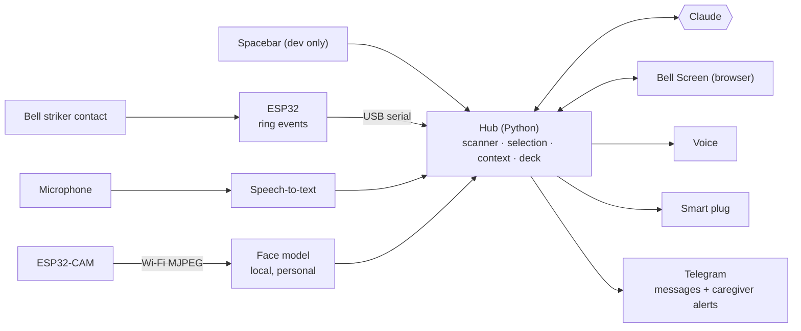

# DING Live Demo: What We're Building Now

**A real, working demo for a real person who is paralysed, has very little hand movement and cannot speak, but whose mind is fully intact.**

*The full vision is in [report.md](report.md). This file covers only what we build now. Replace `[name]` with our user's name (only if they want it used).*

---

## Contents

1. [Goal](#1-goal)
2. [Scope: what's in, what's out](#2-scope-whats-in-whats-out)
3. [Hardware: the bell and what we will measure first](#3-hardware-the-bell-and-what-we-will-measure-first)
4. [How our user uses it](#4-how-our-user-uses-it)
5. [F1: AI context-aware options](#5-f1-ai-context-aware-options)
6. [F2: AI keyboard, quick actions and room control](#6-f2-ai-keyboard-quick-actions-and-room-control)
7. [F3: AI conversation with speech-to-text](#7-f3-ai-conversation-with-speech-to-text)
8. [F4: Facial expression from the ESP32-CAM](#8-f4-facial-expression-from-the-esp32-cam)
9. [Extras](#9-extras)
10. [The screen](#10-the-screen)
11. [Architecture and code layout](#11-architecture-and-code-layout)
12. [AI calls](#12-ai-calls)
13. [Working with our user](#13-working-with-our-user)
14. [Build order](#14-build-order)
15. [Test plan](#15-test-plan)
16. [Demo script (3 minutes)](#16-demo-script-3-minutes)
17. [Demo-day checklist and fallbacks](#17-demo-day-checklist-and-fallbacks)
18. [Open questions](#18-open-questions)

---

## 1. Goal

> Our user uses DING **live, on their own, with only the bell** to:
> 1. get something they need from options DING has already guessed,
> 2. write a message of their choice with the AI keyboard,
> 3. hold a short conversation with someone talking to them,
> 4. switch something in the room on or off,
> 5. *(final step)* have DING notice their facial expression and adapt.

**What counts as done:** our user completes tasks 1–4 without help from the team, three times in a row in rehearsal, and tells us it feels like theirs.

**Principles**
- **Real, not mocked.** A real bell, a real person and real AI. Anything simulated is labelled **SIMULATED** on screen.
- **Our user is a co-designer and co-presenter**, not an exhibit.
- **Their comfort comes before the demo.** If they are tired, we stop.
- **We assume one fact about the bell.** Until the experiments in §3 are done, the software assumes only that **a ring produces a timestamped event**.

---

## 2. Scope: what's in, what's out

### In

| # | Feature | Priority |
|---|---|---|
| **F1** | AI context-aware options | P0 |
| **F2** | AI keyboard: text, word suggestions, sentence completion, quick actions, room control | P0 |
| **F3** | AI conversation: speech-to-text → guessed replies → spoken voice | P0 |
| **F4** | Facial expression as context, from the ESP32-CAM | P1 (built last) |
| — | Voice output, calibration and adaptive scan speed | P0 (F1–F3 need them) |
| — | Extras (§9): Help alert with acknowledgement, learning from picks, offline fallback, and more | P1–P2 |

### Out (for now)

- Any bell sensing beyond the striker contact (no piezo, no plunger position, no force)
- Hold gestures, ring-force tone ("bell prosody"), signature rhythms, Bell Morse
- Room and body sensors (temperature, pulse-oximeter, tilt)
- SOS ring pattern in firmware and the alert path that works without the laptop
- Echo Bells, rituals, phone mode, memoir, a caregiver app beyond a Telegram bot
- Progression tracking, BCI, wheelchair integration

---

## 3. Hardware: the bell and what we will measure first

### 3.1 What we have

| Part | Role |
|---|---|
| **Bell striker module** | The only input. A ring closes the contact. |
| **ESP32 board** | Reads the contact and sends ring events to the laptop over USB |
| **ESP32-CAM** | Video for the facial-expression model (F4) |
| **Laptop** | Runs everything else; main screen |
| **Speaker + microphone** | Voice out, conversation in (laptop built-ins are fine to start) |
| *Optional:* certified Wi-Fi smart plug + lamp or fan | Room control. Without it, show an on-screen device labelled SIMULATED. |
| *Optional:* second screen or tablet | Partner display, so people can read along |

**Suggested wiring:**

```
Bell/striker contact ── side A ──► ESP32 GPIO4  (INPUT_PULLUP, interrupt)
                     └─ side B ──► GND
ESP32 ── USB ──► laptop
```

Use a **separate ESP32 for the bell**. Wiring the bell to the ESP32-CAM is possible but fragile: it has few free pins, and the Wi-Fi video load can disturb ring timing.

### 3.2 Experiments: do these before deciding anything about the contact

| # | Question | How to test | Decides | Result |
|---|---|---|---|---|
| E1 | Does every ring register? | Ring 50 times and count events | Whether the bell is reliable as it is | |
| E2 | How long is the contact closed? Does one ring give one event or several? | Log every pin change with a timestamp (sketch below) | The debounce/lockout approach | |
| E3 | What lockout gives exactly one event per ring? | Try values based on E2's data | Firmware setting | |
| E4 | Does holding the plunger keep the contact closed? | Hold it and watch the log | Whether "hold" can ever be a gesture | |
| E5 | How fast can it be rung again and still give clean events? | Ring as fast as possible | Whether double ring or an SOS pattern is possible | |
| E6 | Do knocks, vibration or moving the table or chair cause events? | Knock, bump, move | Mounting changes or filtering | |
| E7 | **With our user:** where must the bell be, and how much effort does a ring take? | Try positions and mounts together | Mounting | |
| E8 | **With our user:** how many rings before it gets tiring? | Short sessions with breaks | Session length and scan design | |

**Logger sketch (ESP32, Arduino).** Prints `micros,level` for every change on the pin. Paste the output into a spreadsheet or a short Python script to see contact durations and any bounce.

```cpp
// Logs every change on the bell pin with a microsecond timestamp: "micros,level"
const int BELL_PIN = 4;            // contact side A → GPIO4, side B → GND
const int N = 256;
volatile uint32_t ts[N];
volatile uint8_t  lv[N];
volatile uint16_t head = 0;
uint16_t tail = 0;

void IRAM_ATTR onEdge() {
  ts[head % N] = micros();
  lv[head % N] = digitalRead(BELL_PIN);
  head++;
}

void setup() {
  Serial.begin(115200);
  pinMode(BELL_PIN, INPUT_PULLUP);
  attachInterrupt(digitalPinToInterrupt(BELL_PIN), onEdge, CHANGE);
}

void loop() {
  while (tail != head) {
    Serial.printf("%lu,%u\n", (unsigned long)ts[tail % N], lv[tail % N]);
    tail++;
  }
}
```

### 3.3 The contract between the bell and the software

Once the experiments are done, the firmware sends one line per ring, plus a heartbeat:

```json
{"type":"ring","t_ms":918273}
{"type":"hb"}
```

The software needs nothing else. **During development, the laptop's spacebar sends the same `ring` event**, so all the software can be built while the bell experiments happen in parallel. (Testing with our user needs the real bell.)

---

## 4. How our user uses it

- **One ring = choose the highlighted option.** DING highlights options one at a time (auto-scan).
- **Ring when the screen is idle:** DING wakes and shows its best guesses for this moment.
- **Undo, Keyboard, Speak, Rest and Help are options in the scan**, so no special gestures are needed.
- **Scan speed comes from a 2-minute calibration with our user.** They ring when a circle turns green (×10). The highlight time is set from the slow end of their reaction times plus a margin. It then adapts live: an undo slows it a little, and a run of clean picks speeds it up a little.
- **Probabilistic selection:** a ring that comes slightly late still picks the option our user most likely meant, combining their reaction time with how likely each option was. If two options are close, DING asks for a quick confirmation.
- **Rest** pauses scanning until the next ring. After a few silent cycles the screen dims and waits.
- **Options never change while they are being scanned.** New suggestions appear at the start of the next cycle, so nothing moves under our user's eyes.
- **Only after the experiments:** double ring = undo, or a rapid-ring pattern for Help, if E5 and our user show they're reliable.

---

## 5. F1: AI context-aware options

**What our user experiences:** they ring, and the four things they most likely want right now are already on screen, best first. One more ring and it's said or done.

**Context used in the demo**

| Context | Source |
|---|---|
| Time of day, day of week | Clock |
| Who they are: people, routines, favourite phrases, humour, languages | Profile written with them and their caregiver (§13) |
| Who is present | A teammate taps names on a small, labelled control panel. This is context only; it never selects anything. |
| What was just said to them | F3 transcript |
| Lamp and fan state | F2 smart plug |
| Recent choices, today's log | DING's own log |
| Fatigue | Ring timing (reaction times, undos) |
| Facial expression, attention | F4, once built |

**How it works**
1. When the context changes, the hub builds a snapshot and Claude returns a **deck** of four options as JSON (§12).
2. The deck is cached, so it's on screen the moment our user rings.
3. The four options cover four **different** intentions, ordered by probability. Past picks in similar moments push options up (learning from picks, §9).
4. If Claude is slow or offline, a local deck is built from the phrasebook for this time of day.

**Done when**
- Our user's actual need is in the first deck in most tries during testing (hit rate logged, §15).
- The deck appears within 1 s of an idle ring.
- With Wi-Fi off, a local deck still appears.

---

## 6. F2: AI keyboard, quick actions and room control

**What our user experiences:** when none of the options fit, they pick *Keyboard*. DING predicts words and whole sentences from the conversation and the context, so they spell as little as possible.

| Part | What it does |
|---|---|
| **Draft line** | The message being written |
| **Sentence completions** | 2–3 full endings for the current draft (Claude) |
| **Word suggestions** | 5 next-word predictions from the draft + conversation + context (Claude), with a local word list for instant results |
| **Initials and keyword expansion** | `i w t g o` → *"I want to go outside"*; `water cold please` → *"Could I have some cold water, please?"* |
| **Letters** | A dynamic row of the 6 likeliest next letters, above a fixed frequency-ordered grid. Space and Delete. |
| **Speak / Send** | Say it aloud, or send it to a family member on Telegram |
| **Quick actions** (always one ring away) | Yes · No · Wait · Thank you · Help · Lamp · Fan · Call [caregiver] |
| **Room control** | Lamp or fan on a certified smart plug. The screen shows the current state and offers the opposite. |

**Scan order in the keyboard:** completions → words → dynamic letters → grid → controls. The more confident DING is, the higher completions sit.

**Done when**
- Our user writes a message of their own choosing (~10 words) and it's spoken or sent.
- We log the rings for that message and compare them with letter-only spelling of the same message.
- The lamp or fan switches with one ring, and the screen shows the new state.

---

## 7. F3: AI conversation with speech-to-text

**What our user experiences:** someone talks to them. Within moments the words appear on screen with 3–4 replies DING has guessed, in our user's style. One ring, and DING says the reply out loud.

```
mic → voice activity detection → speech-to-text → what kind of utterance? → reply options → ring → voice
```

| Heard | Options shown |
|---|---|
| Yes/no question | YES · NO · A LITTLE · LET ME EXPLAIN |
| Choice (*"Tea or coffee?"*) | The choices from the question · NEITHER · SOMETHING ELSE |
| Open question | Three answers in their style · Keyboard |
| Statement or joke | Quick reactions · two replies |

**Details**
- **Everyone heard is someone else**, because our user doesn't speak. We don't need to separate speakers.
- **A "listening" indicator** is always on screen, and *Mute* is an option in the scan.
- **Quick reactions** (😂 Haha, Exactly, No way, Hmm) let our user join the rhythm of the conversation, not just its content.
- **"✋ Wait, I want to say something"** plays a soft chime and shows *typing…* on the partner display.
- **Pre-composing:** reply options start generating the moment a question ends.
- **Voice:** chosen by our user, or cloned from old recordings **only with their consent**. Offline fallback: Piper or macOS `say`.
- **Language and accent:** test speech-to-text with our user's family and in the venue's noise before relying on it. Quality varies across accents and Indian languages.

**Done when**
- A 4-exchange conversation where most replies take ≤ 2 rings.
- Ring-to-voice is under ~1 s.
- It works with someone our user doesn't know (e.g. a judge) asking the questions.

---

## 8. F4: Facial expression from the ESP32-CAM

*Built last. Everything else must work without it.*

**What our user experiences:** if they look tired or uncomfortable, DING notices. *"I'm tired, can we stop?"* moves up and the scan slows. When their eyes close or they look away, scanning pauses so they don't miss options.

> **Important:** ALS and locked-in syndrome can weaken or change facial expression. Generic emotion models are trained on typical faces and may badly misread our user. So the model is **calibrated on our user's own face**, DING **shows its guess** (*"Looks tired?"*) so it can be corrected, and it is only ever a **weak hint** that re-ranks options. It never acts on its own.

**Pipeline (recommended for the demo)**

```
ESP32-CAM (CameraWebServer example, MJPEG over Wi-Fi)
  → laptop: OpenCV reads http://<cam-ip>:81/stream
  → MediaPipe Face Landmarker: 52 blendshape scores (eye closure, brows, mouth…) + head pose
  → small personal classifier (k-NN or logistic regression, scikit-learn)
  → {"label": "tired", "confidence": 0.71, "looking_at_screen": true}   about once per second
  → context engine
```

**Personal calibration (~5 minutes, with consent):** with our user and their caregiver, record 20–30 seconds of each state that matters to *them*, for example *comfortable*, *tired*, *uncomfortable*, *happy*. The states, and what each one looks like, come from our user and their caregiver, not from us. Train the classifier on those samples.

**Rules**
- Eyes closed or face turned away for more than ~2 s: pause scanning.
- Sustained `tired` at high confidence: slower scan, *Rest* moves up.
- `uncomfortable`: *"Something's wrong"* and *"Move me"* move up.
- Frames are processed in memory and never saved or sent. Claude only sees the label.

**ESP32-CAM tips:** a solid 5 V 2 A supply (brownouts are common), QVGA or VGA resolution for speed, even lighting on the face, and mount it just below the main screen.

**Stretch:** run a tiny model on the ESP32-CAM itself (e.g. Edge Impulse or ESP-DL) and send only labels. It's slower and less accurate, so try it only after the laptop version works.

**Done when**
- Pausing on closed eyes or looking away works reliably.
- In at least one live moment, the expression visibly changes the top option, and our user agrees it was right.

---

## 9. Extras

Chosen from the full report because they make the demo usable, safe or convincing:

| Extra | Why | Priority |
|---|---|---|
| **Voice output** | F1–F3 need it | P0 |
| **Calibration + adaptive scan speed** | Makes it work for *this* person | P0 |
| **Help + caregiver alert** | *Help* sends a Telegram alert with a **Coming** button. When it's tapped, the screen and voice say *"[caregiver] is coming."* | P1 |
| **Learning from picks** | Chosen options rank higher next time. We show this improving during the demo. | P1 |
| **Quick reactions + hold the floor** | Conversation timing (part of F3) | P1 |
| **Offline fallback** | Venue Wi-Fi fails all the time | P1 |
| **Partner display** | People can read what's being said | P2 |
| **Caregiver "Ask"** | The caregiver sends choices from Telegram (*"Tea or coffee?"*) that appear as options | P2 |
| **Home language** | If our user speaks a different language at home | P2 |

---

## 10. The screen

**Main view** (the options shown are illustrative; real ones are generated in our user's style):

```
┌──────────────────────────────────────────────────────────────────────────┐
│ 15:42 · With: [caregiver], judges · Face: relaxed (62%) · 🎙 listening   │ ← context
├──────────────────────────────────────────────────────────────────────────┤
│ Heard: "What made you want to try this?"                                 │ ← F3
├──────────────────────────────────────────────────────────────────────────┤
│ ▶ ① Honestly? I was tired of people guessing what I want.                │ ← F1 / F3
│   ② I wanted my jokes back.                                              │
│   ③ My family pushed me. I'm glad they did.                              │
│   ④ Keyboard…                                                            │
├──────────────────────────────────────────────────────────────────────────┤
│ Quick: 😂 Haha · 👍 Yes · 👎 No · ✋ Wait · 💡 Lamp · 🌀 Fan · 🆘 Help      │ ← F2
│ Controls: ↶ Undo · ⏸ Rest · 🔇 Mute                                      │
└──────────────────────────────────────────────────────────────────────────┘
```

**Keyboard view:**

```
┌──────────────────────────────────────────────────────────────────────────┐
│ Draft: Tell Meena I'm proud of _                                         │
├──────────────────────────────────────────────────────────────────────────┤
│ ▶ Complete:  "…her. Dinner is on me."  ·  "…her new job."                │
│   Words:     her · you · the · them · myself                             │
│   Next:      [ H  Y  T  M  E  A ]          ← likeliest next letters      │
│   Grid:      E T A O I N │ S H R D L U │ C M F W Y P │ G B V K J X Q Z   │
│   Controls:  ␣ Space · ⌫ Delete · 🔊 Speak · ✉ Send to… · ↶ Back         │
└──────────────────────────────────────────────────────────────────────────┘
```

**Rules:** no more than four options at once, one highlight at a time, large high-contrast text, the screen at our user's eye level, and a dim mode for evenings.

---

## 11. Architecture and code layout



| Layer | Choice |
|---|---|
| Firmware | ESP32, Arduino core: one interrupt, JSON lines over USB serial |
| Hub | Python 3.11, FastAPI + WebSockets, pyserial |
| AI | Anthropic SDK, Claude Opus 5.5 (`claude-opus-5-5`) |
| Speech-to-text | faster-whisper with its built-in voice-activity filter; a cloud option if the laptop is too slow |
| Voice | Chosen or cloned voice, with Piper or macOS `say` as the offline fallback |
| Face | OpenCV + MediaPipe Face Landmarker + scikit-learn |
| UI | Browser page, full screen |
| Room | Certified smart plug controlled from Python. Never DIY mains wiring. |
| Messages and alerts | Telegram bot (python-telegram-bot) |
| Log | SQLite: every ring, highlight, pick and skip (for learning and metrics) |

**Suggested hub modules**

| Module | Job |
|---|---|
| `bell.py` | Read serial ring events (+ spacebar in dev) |
| `scanner.py` | Highlight timing, probabilistic selection, calibration, adaptive speed |
| `context.py` | Build the context snapshot |
| `brain.py` | Claude calls (deck, reply, keyboard) + local fallback |
| `stt.py` / `tts.py` | Listening and speaking |
| `face.py` | Camera stream → expression label + attention |
| `room.py` | Smart plug |
| `telegram_bot.py` | Messages, Help alerts, Coming acknowledgement, caregiver Ask |
| `log.py` | Event log + metrics |
| `ui/` | The Bell Screen |

---

## 12. AI calls

Three request types share one cached prefix (rules + profile + phrasebook + style samples):

| Call | When | Returns |
|---|---|---|
| **deck** | Context changes; idle ring | 4 options + quick reactions |
| **reply** | A finished utterance is heard | Utterance type + 3–4 replies |
| **keyboard** | The draft changes (at word boundaries) | Next words, completions, expansions |

**Context snapshot (demo):**

```json
{
  "time": "15:42", "day": "Sat", "place": "hackathon venue",
  "people_present": ["[caregiver]", "judges"],
  "heard": [{"text": "What made you want to try this?", "secs_ago": 1}],
  "draft": "",
  "devices": {"lamp": "off", "fan": "on"},
  "face": {"label": "relaxed", "confidence": 0.62, "looking_at_screen": true},
  "fatigue": 0.2,
  "recent_choices": ["Introduce myself (15:40)"]
}
```

**Keyboard response:**

```json
{
  "next_words": ["her", "you", "the", "them", "myself"],
  "completions": ["…her. Dinner is on me.", "…her new job."],
  "expansions": []
}
```

The deck and reply schemas are in [report.md §7.8](report.md#78-how-ding-uses-claude), along with the system prompt sketch.

**Model and latency notes**
- **Opus 5.5 at low effort** with structured outputs and prompt caching. **Measure ring-to-option latency first.** If it's too slow, route only the hot path to Claude Haiku 4.5 (`claude-haiku-4-5`).
- **Deck:** pre-computed, so 0 ms when our user rings.
- **Reply:** target options on screen within ~2 s of the question ending (to be measured).
- **Keyboard:** local word suggestions appear instantly. Claude's suggestions replace them at the start of the next scan cycle.
- **Always check the stop reason** and fall back to local options on any error, so the screen never freezes.

---

## 13. Working with our user

*This is the most important section.*

**Before building around them**
- Meet our user and their caregiver. Explain DING in plain words.
- **Get consent for each part separately**, through their usual way of communicating, with the caregiver present: bell testing, microphone, camera, voice cloning, being in the demo, photos and video.
- **Profile session (~30 min, with the caregiver):** names and relationships, daily routine, favourite topics, phrases they actually use, humour, languages, things they never want said, and what they'd like to say on stage.
- **Let them choose their voice.**
- Run **E7 and E8** with them (bell placement and comfort), then the calibration (§4).
- **Agree on a stop signal that doesn't depend on DING**, using their usual yes/no method.

**During testing**
- Short sessions with breaks. Stop at the first sign of tiredness.
- **Their existing communication and call methods stay in place.** DING is an addition, never a replacement.
- Talk *to* them, not about them or only to their caregiver.
- Ask what was annoying, slow or wrong, and fix those first.

**At the demo**
- They decide whether and how they appear on stage.
- They choose what they'll say, and rehearse it with DING.
- Credit them as co-designer, by name if they want.
- No photos or video without their consent.
- If they're tired on the day, show the rehearsal video (only with consent) and say so.

---

## 14. Build order

Each milestone leaves a working demo.

| # | Milestone | Needs | Size |
|---|---|---|---|
| **M0** | Spacebar → scanning screen → voice speaks the chosen option | — | S |
| **M1** | Calibration, adaptive scan speed, event log | M0 | S |
| **M2** | **F1:** Claude context deck (profile + time + who's present) + local fallback | M0 | M |
| **M3** | **F3:** speech-to-text → reply options → voice; quick reactions | M2 | M |
| **M4** | **F2:** keyboard with completions, words, expansion; Speak/Send; smart plug | M2 | L |
| **M5** | Real bell replaces the spacebar (after E1–E6) | Experiments | S |
| **M6** | Extras: Help + Telegram acknowledgement, learning from picks, offline deck | M2 | M |
| **M7** | **F4:** ESP32-CAM face model, pause on eyes closed, label in context | M2 | L |
| **M8** | Rehearse with our user, fix what they flag, polish | All | — |

**Team split (4 people)**

| Role | Owns |
|---|---|
| Hardware | Bell experiments, ESP32 firmware, ESP32-CAM, smart plug |
| Hub + AI | Scanner, context, Claude calls, speech-to-text, voice |
| Screen | Bell Screen, keyboard view, partner display |
| User + story | Profile session, testing with our user, metrics, demo script |

---

## 15. Test plan

Run each task with our user. Where possible, they choose the content.

| Task | Example | Measure |
|---|---|---|
| **T1 · Need** | A real need in the moment | Rings, seconds, in the first deck? |
| **T2 · Message** | Something they actually want to tell someone | Rings, seconds, compared with letter-only spelling |
| **T3 · Conversation** | 4 exchanges with a teammate, then with a stranger | Rings per reply, ring-to-voice time, replies they say were right |
| **T4 · Room** | Lamp on, lamp off | Rings, success |
| **T5 · Face** | Eyes closed / looking tired | Correct pause? Sensible re-ranking? |

**Always log:** undos, false rings, their rating (1–5) and their own words about it.

| Session | Task | Rings | Seconds | First deck hit? | Undos | Rating | Notes |
|---|---|---|---|---|---|---|---|
| | | | | | | | |

---

## 16. Demo script (3 minutes)

| Time | Beat |
|---|---|
| **0:00** | A single *ding*. Teammate: *"Hector Salamanca had a bell that said one thing: come here. Today, [name] is going to use one."* |
| **0:15** | **[name] introduces themselves through DING**: a sentence they wrote with the keyboard in rehearsal, chosen live with one ring. |
| **0:35** | **F1:** [name] rings from idle and DING's options for this moment appear. One ring, and it's said or done. |
| **1:00** | **F3:** *"Judges, ask [name] anything."* The question appears, reply options appear, one ring, and it's answered aloud. (A teammate has a backup question ready.) |
| **1:45** | **F2:** a short message on the keyboard, sent to family on Telegram, with the phone on stage showing it arrive. Then the lamp on with one ring. |
| **2:25** | **F4 (if built):** eyes close and scanning pauses; DING shows *"Looks tired?"* |
| **2:40** | **[name] chooses the closing words.** Teammate: *"One finger, one bell, every word. Built with [name], not for them."* |

---

## 17. Demo-day checklist and fallbacks

**Checklist**
- [ ] Our user is rested and comfortable, has agreed to today's plan, and their caregiver is present
- [ ] Bell mounted in the position found in E7; calibration run that day
- [ ] Laptop charged; phone hotspot ready as backup internet
- [ ] Cache warmed (a few deck calls just before going on)
- [ ] Microphone tested in the room's noise; speaker volume checked
- [ ] ESP32-CAM lit and streaming; face model checked on our user
- [ ] Smart plug on the same network and tested
- [ ] Telegram phone on stage with notifications on

**Fallbacks**

| If this fails | Do this |
|---|---|
| Internet | Local decks, local word suggestions, offline voice |
| Bell hardware | Swap the ESP32 or re-seat the wires. The spacebar is only for showing the software, and we say so openly. **No one presses anything for our user.** |
| Speech-to-text | A teammate types the question into the hub, labelled on screen |
| Camera | Skip F4. That's why it's last. |
| Smart plug | On-screen device labelled SIMULATED |
| Our user is tired | Stop. Show the rehearsal video (with consent) and explain. |

---

## 18. Open questions

- Results of experiments E1–E8.
- Which ESP32 board the bell uses (separate from the ESP32-CAM).
- Our user's languages, for speech-to-text and voice.
- Whether old recordings exist for voice cloning, and whether our user wants it.
- Which smart plug, and how we control it from Python.
- Lighting at the venue for the camera.
- Which facial states matter to our user and their caregiver.
